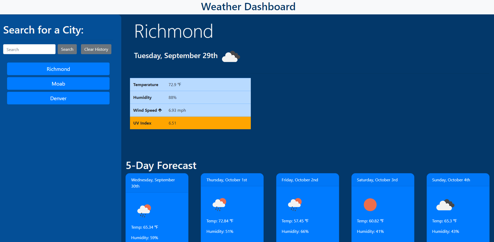

# Welcome to my Weather Dashboard

I've used the OpenWeatherMap API to build a weather dashboard that will run in the browser and feature dynamically updated HTML and CSS. Local Storage will store persistent data.

The Weather Dashboard uses the OpenWeatherMap API to display current and forecasted weather for a given city. When the user searches for a city, the city name is used to pull the current weather for that city. The five-day forecast and UV index are populated using the lat/long returned from the current city weather API call, which is passed into a subsequent API call for the additional data. The UV Index is color coded based on the value returned.

[Check out the deployed app here!](https://markdcross.github.io/weather-dashboard/)

# Technology/Skills
* HTML
* CSS
* JavaScript
* jQuery
* AJAX
* moment.js
* Local storage

# Local Storage

When the user searches for a city, the city name is saved to local storage and a button is created in the search history element below the search bar. The user can simply click the button corresponding to a previously searched city to see that weather again. If the page is reloaded, the search history persists and the most recent search is populated on screen. If the user searches for an invalid city, an error is thrown and no button is created.

# Screenshots

# Contact
Please reach out to me with any questions or feedback via [GitHub](https://github.com/markdcross "Visit Mark's GitHub"), [LinkedIn](https://www.linkedin.com/in/markdcross/ "Visit Mark's LinkedIn"), or [Email](mailto:markdcross@gmail.com)

# License
MIT License

Copyright (c) 2020 Mark Cross

Permission is hereby granted, free of charge, to any person obtaining a copy of this software and associated documentation files (the "Software"), to deal in the Software without restriction, including without limitation the rights to use, copy, modify, merge, publish, distribute, sublicense, and/or sell copies of the Software, and to permit persons to whom the Software is furnished to do so, subject to the following conditions:

The above copyright notice and this permission notice shall be included in all copies or substantial portions of the Software.

THE SOFTWARE IS PROVIDED "AS IS", WITHOUT WARRANTY OF ANY KIND, EXPRESS OR IMPLIED, INCLUDING BUT NOT LIMITED TO THE WARRANTIES OF MERCHANTABILITY, FITNESS FOR A PARTICULAR PURPOSE AND NONINFRINGEMENT. IN NO EVENT SHALL THE AUTHORS OR COPYRIGHT HOLDERS BE LIABLE FOR ANY CLAIM, DAMAGES OR OTHER LIABILITY, WHETHER IN AN ACTION OF CONTRACT, TORT OR OTHERWISE, ARISING FROM, OUT OF OR IN CONNECTION WITH THE SOFTWARE OR THE USE OR OTHER DEALINGS IN THE SOFTWARE.
